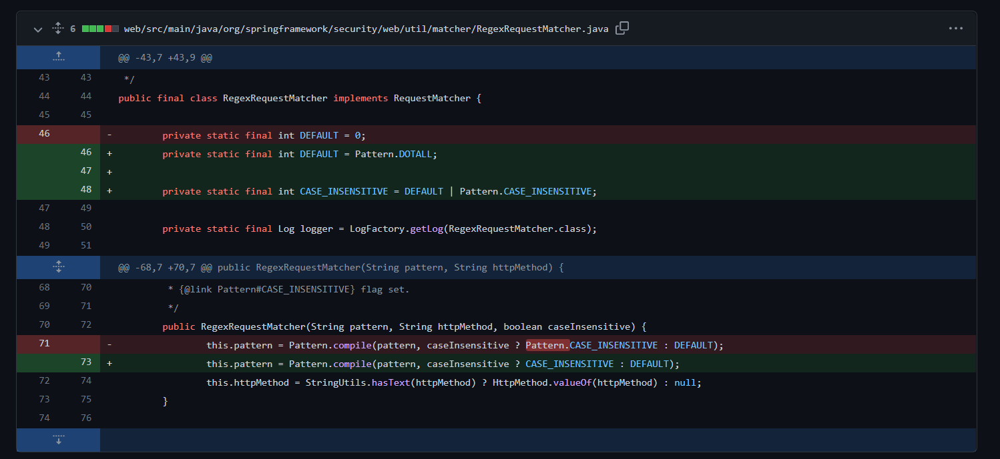
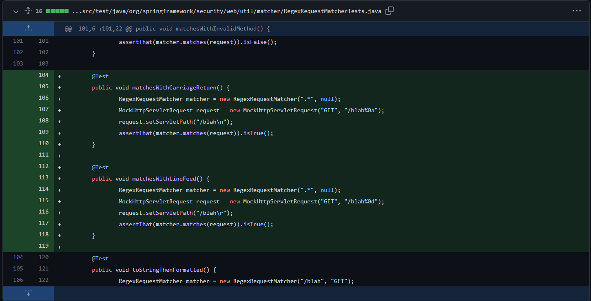
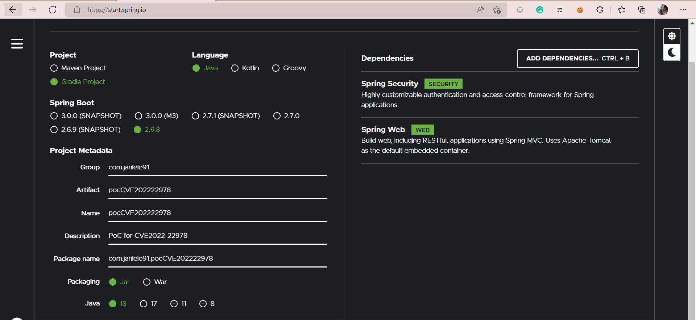
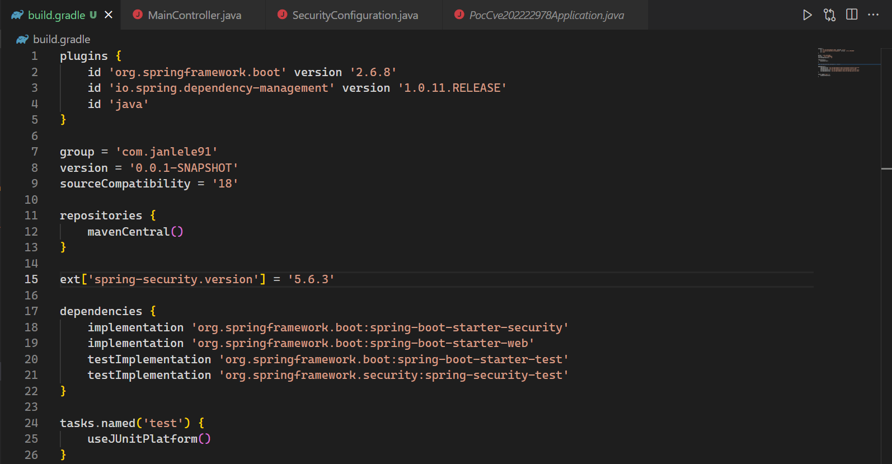

# CVE 2022-22978: **Authorization Bypass in RegexRequestMatcher** 🥶

### Khái quát

Theo thông tin em tìm hiểu được, đây là lỗ hổng liên quan đến class **RegexRequestMatcher** trong framework Spring Security. Cụ thể, những application sử dụng RegexRequestMatcher mà trong regular expression có chứa dấu chấm (.) sẽ bị bypass bằng các kí tự **\r(%0a)** , **\n(%0d)**; từ đó các attacker không cần xác thực mà vẫn có thể truy cập vào các đường dẫn không cho phép.

Các version bị dính lỗ hổng của framework Spring Security:

- `5.5.x` trước `5.5.7`
- `5.6.x` trước `5.6.4`
- Các unsupported versions trước đó.

### Phân tích 

Ta cần truy cập vào mã nguồn của Spring Security để phân tích tĩnh lỗ hổng này. Cụ thể ở đây, em dùng chức năng so sánh các commits giữa 2 version 5.6.3 (version bị dính lỗ hổng) và 5.6.4 (version đã fix lỗi) của Github. Xem ở link sau: [Comparing 5.6.3...5.6.4 · spring-projects/spring-security (github.com)](https://github.com/spring-projects/spring-security/compare/5.6.3...5.6.4)


Em thực hiện kiểm tra những thay đổi trong class `RegexRequestMatcher`. Có thể thấy, ở version `5.6.4`, class này sử dụng `Pattern.DOTALL` thay vì dùng `.` mặc định như version  `5.6.3`. 

Trong đó:

- `Pattern` : là một trong 3 class có trong gói`java.util.regex`, có chức năng xử lý các regular expression.
- `Pattern.DOTALL` : Khi sử dụng flag này, “.” trong regular expression sẽ match với tất cả các kí tự, kể cả kí tự xuống dòng như `\n , \r`.
- `Pattern.CASE_INSENSITIVE`: không quan tâm kí tự in hoa hay in thường.



Theo mặc định, dấu `.` trong regular expression sẽ match tất cả các kí tự trừ các kí tự xuống dòng như `\n, \r`. Khi đó nếu như trong trường hợp có hàm regex validate pattern của một chuỗi nào đó thì hàm regex đó sẽ không match nếu có các kí tự xuống dòng trong chuỗi. Để tránh việc này, có thể sử dụng flag `Pattern.DOTALL`. 

Tuy nhiên nếu như có người cố tình dùng `%0d` thay vì `\n` hay`%0a` thay vì `\r` thì regex trên vẫn không thể match. Do đó, ở version 5.6.4, đã có đoạn check thêm trường hợp này trong `RegexRequestMatcherTests.java`. Cụ thể, nó sẽ convert `%0d` và `%0a` lần lượt thành `\n` và `\r` rồi mới check bằng regex.



### Demo 

***Bước 1:*** Tạo một spring boot web application bằng [Spring Initializr](https://start.spring.io/) với 2 dependencies kèm theo là Spring Security và Spring Web. 



***Bước 2:*** Tạo một Controller thực hiện in ra dòng chữ `This is a CVE-2022-22978 demo` khi có request đến đường dẫn `/admin/*` 


***Bước 3:*** Thiết lập cơ chế xác thực mỗi khi user truy cập vào đường dẫn `/admin/<bất kì>` bằng sử dụng `regexMatchers("/admin/.*").authenticated()` . Đây chính là lỗ hổng các attacker tận dụng để xem nội dung của các trang `/admin/<bất kì>` mà không cần xác thực.


***Bước 4:*** Ở file cấu hình, thực hiện khai báo version của Spring Security mà có chứa lỗ hổng. Ở đây mình chọn version `5.6.3`.



***Bước 5:*** Chạy ứng dụng bằng câu lệnh `gradlew bootRun` , chương trình mặc định dùng Apache Tomcat lắng nghe ở port 8080. Ta truy cập vào đường dẫn `/admin/xyz` (đường dẫn nào cũng được miễn là từ `/admin/`).


Kết quả trả về mã `403 Forbidden` nghĩa là mình không thể truy cập do chưa xác thực.

Lúc này, tận dụng lỗ hổng của hàm regexMatchers trong Sping Security (version `5.6.3`) khi nó không match các kí tự xuống dòng như `\r(%0d)` và `\n(%0a)` → mình có thể truy cập vào đường dẫn trên mà không cần xác thực bằng payload `/admin/%0dxyz`


Tương tự với payload `/admin/%0axyz`


Như vậy ta đã tận dụng được lỗ hổng CVE-2022-22978 thành công chỉ với một payload vô cùng đơn giản.

### Cách khắc phục

- Update version của Spring Security lên thành:
    - 5.5.7+
    - 5.6.4+
    - 5.7+
- Demo: Sử dụng phiên bản đã fix lỗi, cụ thể là `5.7.1`


Thử tấn công web bằng payload tương tự trên: `/admin/%0dxyz`


Lúc này, app đã không trả về response như attacker mong muốn.

### Usage

```git
git clone https://github.com/ducluongtran9121/CVE-2022-22978-PoC.git
cd CVE-2022-22978-PoC
gradlew bootRun
```

### Requirements

```
Java 18
Gradle 7.4.1
```